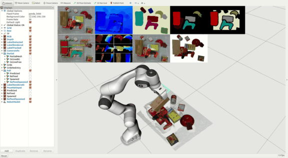
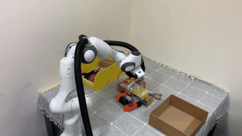
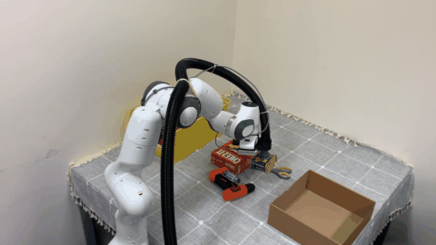

<h1 align="center">
  MoreFusion
</h1>

<h3 align="center">
  Multi-object Reasoning for 6D Pose Estimation from Volumetric Fusion
</h3>

<div align="center">
  <a href="https://wkentaro.com">Kentaro Wada</a>,
  Edgar Sucar,
  <a href="https://stepjam.github.io/">Stephen James</a>,
  Daniel Lenton,
  <a href="https://www.doc.ic.ac.uk/~ajd/">Andrew J. Davison</a>
  <br/>
  <a href="https://www.imperial.ac.uk/dyson-robotics-lab/">
    Dyson Robotics Laboratory
  </a>,
  <a href="https://www.imperial.ac.uk/">Imperial College London</a>
  <br/>
  IEEE Conference on Computer Vision and Pattern Recognition (CVPR), 2020
</div>

<p></p>

<div align="center">
  <a href="#installation"><b>Installation</b></a> |
  <a href="#usage"><b>Usage</b></a> |
  <a href="https://arxiv.org/abs/2004.04336"><b>Paper</b></a> |
  <a href="https://www.youtube.com/watch?v=6oLUhuZL4ko"><b>Video</b></a> |
  <a href="https://morefusion.wkentaro.com"><b>Website</b></a>
</div>

<p></p>

<div align="center">
  
  
</div>

MoreFusion is an object-level reconstruction system that builds a map with
set of known-shaped objects, exploiting volumetric reconstruction of detected
objects in a real-time, incremental scene reconstruction senario. The key
component of this system is:
- **Occupancy-based volumetric reconstruction** of detected objects for model
  alignment in the later stage;
- **Volumetric pose prediction** that exploits volumetric reconstruction and
  CNN feature extraction from the image observation;
- **Joint pose refinement of objects** based on geometric consistency
  among objects and impenetrable space.

##

<div>
  <a href="https://youtu.be/6oLUhuZL4ko?t=19">
    
  </a>
  <a href="https://youtu.be/6oLUhuZL4ko?t=65">
    
  </a>
  
</div>

## Installation

There're several options for installation:

- [Python project only](#python-project-only): Python framework for pose
  estimation (e.g., training, inference, refinement).
- [ROS project for camera
  demonstration](#ros-project-for-camera-demonstration): ROS framework for
  object-level mapping with live cameras.
- [ROS project for robotic
  demonstration](#ros-project-for-robotic-demonstration): ROS framework for
  robotic demonstration with object-level mapping.

### Python project only

```bash
make install
```

### ROS project for camera demonstration

```bash
mkdir -p ~/ros_morefusion/src
cd ~/ros_morefusion/src

git clone https://github.com/wkentaro/morefusion.git
cd morefusion
make install

cd ~/ros_morefusion
ln -s src/ros/*.sh .

./rosdep_install.sh
./catkin_build.robot_agent.sh

source .autoenv.zsh
```

### ROS project for robotic demonstration

- `robot-agent`: A computer for visual processing.
- `robot-node`: A computer with real-time OS for Panda robot.

#### @robot-agent

Same as above instruction:
<a href="#ros-project-for-camera-demonstration">ROS project for camera demonstration</a>.

#### @robot-node

```bash
mkdir -p ~/ros_morefusion/src
cd ~/ros_morefusion/src

git clone https://github.com/wkentaro/morefusion.git

cd ~/ros_morefusion
ln -s src/ros/*.sh .

./catkin_build.robot_node.sh
source devel/setup.bash

rosrun franka_control_custom create_udev_rules.sh
```

## Usage

### ROS demonstration

#### Static Scene

```bash
# using orb-slam2 for camera tracking
roslaunch morefusion_panda_ycb_video rs_rgbd.launch
roslaunch morefusion_panda_ycb_video rviz_static.desk.launch
roslaunch morefusion_panda_ycb_video setup_static.desk.launch
```

<div>
  
  <br/>
  <i>Figure 1. Static Scene Reconstruction with the Human Hand-mounted Camera.</i>
</div>

```bash
# using robotic kinematics for camera tracking
roslaunch morefusion_panda_ycb_video rs_rgbd.robot.launch
roslaunch morefusion_panda_ycb_video rviz_static.robot.launch
roslaunch morefusion_panda_ycb_video setup_static.robot.launch
```

<div>
  
  <br/>
  <i>Figure 2. Static Scene Reconstruction with the Robotic Hand-mounted Camera.</i>
</div>

#### Dynamic Scene

```bash
roslaunch morefusion_panda_ycb_video rs_rgbd.launch
roslaunch morefusion_panda_ycb_video rviz_dynamic.desk.launch
roslaunch morefusion_panda_ycb_video setup_dynamic.desk.launch

roslaunch morefusion_panda_ycb_video rs_rgbd.robot.launch
roslaunch morefusion_panda_ycb_video rviz_dynamic.robot.launch
roslaunch morefusion_panda_ycb_video setup_dynamic.robot.launch
```

<div>
  
  <br/>
  <i>Figure 3. Dynamic Scene Reconstruction with the Human Hand-mounted Camera.</i>
</div>

#### Robotic Pick-and-Place

```bash
robot-agent $ sudo ntpdate 0.uk.pool.ntp.org  # for time synchronization
robot-node  $ sudo ntpdate 0.uk.pool.ntp.org  # for time synchronization

robot-node  $ roscore

robot-agent $ roslaunch morefusion_panda panda.launch

robot-node  $ roslaunch morefusion_panda_ycb_video rs_rgbd.robot.launch
robot-node  $ roslaunch morefusion_panda_ycb_video rviz_static.launch
robot-node  $ roslaunch morefusion_panda_ycb_video setup_static.robot.launch TARGET:=2
robot-node  $ rosrun morefusion_panda_ycb_video robot_demo_node.py
>>> ri.run()
```

<div>
  
  
  
  <br/>
  <i>Figure 4. Targetted Object Pick-and-Place. (a) Scanning the Scene; (b) Removing Distractor Objects; (c) Picking Target Object.</i>
</div>


## Citation

If you find MoreFusion useful, please consider citing the paper as:

```
@inproceedings{Wada:etal:CVPR2020,
  title={{MoreFusion}: Multi-object Reasoning for {6D} Pose Estimation from Volumetric Fusion},
  author={Kentaro Wada and Edgar Sucar and Stephen James and Daniel Lenton and Andrew J. Davison},
  booktitle={Proceedings of the {IEEE} Conference on Computer Vision and Pattern Recognition ({CVPR})},
  year={2020},
}
```
